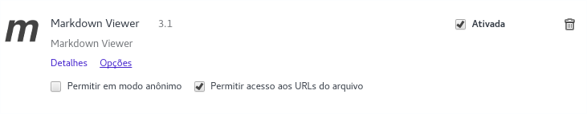
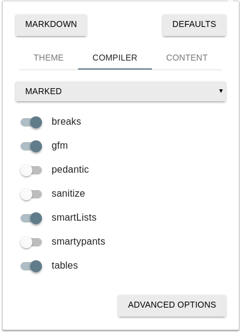

  

[About](../../About.md) :: [How-To Tecnico](../How-To-Tecnico.md) :: [Setup Ambiente](Setup-Ambiente.md)

 [Voltar para Home](../../../Index.md) 

#  Procedimentos para preparação do ambiente para Consulta e Manutenção da Documentação

## Instalar e Configurar a IDE Atom

1. Efetuar download da IDE "Atom" em https://atom.io/
2. Instalar a IDE `sudo dnf install atom.x86_64.rpm`
3. Instalar os pacotes opcionais:   _Para Instalar os pacotes adicionais pressione `ctrl+,` botão: `Install`_
  1. Language-Markdown
  2. Markdown-Writer
  2. Markdown-Preview-Plus
  3. Markdown-Scroll-Sync
  4. Markdown-Toc
  5. Tool-Bar
  6. Tool-Bar-Markdown-Writer

## Instalar e Configurar o plugin para Chrome

1. Instalar o plugin
2. Marcar a opção `Permitir Acesso as URLs do Arquivo`
3. Configure o plugin com as opções abaixo:

## Instalar ferramenta case: Astah

1. Efetuar o download em: `http://astah.net/download`   _Nota: Baixar a opção trial 50 dias_
2. Instalar a ferramenta: `sudo dnf install astah-professional-7.1.0.f2c212-0.noarch.rpm`
3. Para abrir a ferramenta executar o comando: `astah-pro`
