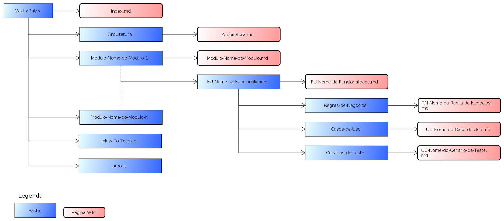

  
  

[About](../About.md) :: [Organizacao-Fisica](Organizacao-Fisica.md)

 [Voltar para Home](../../Index.md) 

# Esquema Físico da Documentação

**IMPORTANTE:** Esta estrutura de pastas e arquivos é Fixa e não pode ser alterada.

- [Index](Organizacao-Fisica/Index.md)
- [Arquitetura](Organizacao-Fisica/Arquitetura.md)
- [Módulos](Organizacao-Fisica/Modulo.md)
- [Funcinalidades](Organizacao-Fisica/Funcionalidade.md)
