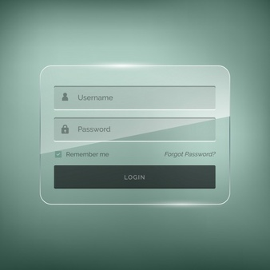

[Home](../../../Index.md) :: [Módulo Nome-do-Módulo](../../Modulo-Nome-do-Modulo.md) :: [FU Nome da Funcionaldade](../FU-Nome-da-Funcionalidade.md) :: [TC Nome do Cenário de Testes](TC-Nome-do-Cenario-de-Testes.md)

  Template da página de documentação de **Cenário de Testes Manual** e do caso de testes correspondente.  Os textos de instruções estão em verde e devem ser removidos do artefato final, inclusive as tags `div`.

# Cenário de Testes: Nome-do-Cenário-de-Testes

## Objetivo

  Objetivo do cenário de testes

## Setup

 Configurações ou passos que devem ser garantidos para que o teste possa ser realizado.

## Caso de Teste

Caso de teste que realiza o cenário decrito

Tabela dos passos de caso de teste

| Passo                                                                       | Resultado Esperado                                               |
|-----------------------------------------------------------------------------|------------------------------------------------------------------|
| 
Passos a serem executados
                    | 
Resultado esperado de cada passo
  |
| 
Imagens devem ser referencias internas, ex: 
 | Sistema apresenta tela de login: [Tela de Login](#tela-de-login) |

### Tela de Login

 Exemplo de imagem 

_[Sobre o Portal de Documentação](../../../About/About.md)_

